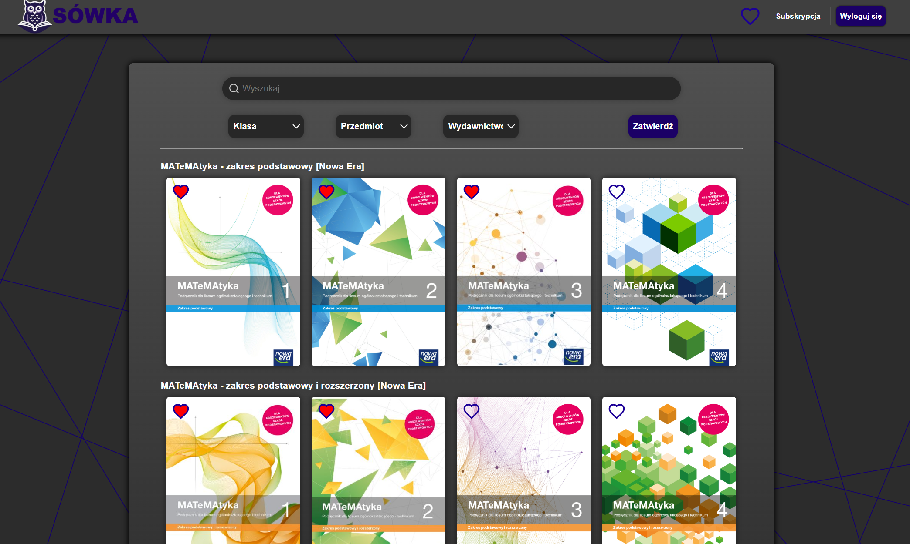

# Sówka

**Sówka** to w przyszłości będzie innowacyjna platforma edukacyjna działająca na zasadzie biblioteki podręczników, oferująca cyfrowy dostęp do podręczników szkolnych. Rozwiązanie to pozwala uczniom korzystać z książek w dowolnym miejscu mając je zawsze pod ręką.

<h2>Zrzut ekranu</h2>

Zrzut okna strony:  




<h2>Jak uruchomić projekt?</h2>

1. **Pobierz projekt**  
   - Sklonuj repozytorium lub pobierz paczkę ZIP z projektem.

2. **Skonfiguruj środowisko**  
   - Uruchom Apache oraz MySQL w XAMPP.  
   - Skopiuj pliki projektu do folderu `htdocs`.  

3. **Zainstaluj bazę danych**  
   - Otwórz phpMyAdmin i zaimportuj plik `sowka.sql`.  
   - Upewnij się, że baza danych nazywa się `sowka`.  

---

4. **Uruchom aplikację w przeglądarce**  
   - Otwórz przeglądarkę i przejdź pod adres:  
     ```
     http://localhost/nazwa_katalogu_projektu
     ```

---

<h2>Technologie</h2>

- **Frontend**: HTML, CSS, JavaScript  
- **Backend**: PHP  
- **Baza danych**: MySQL  

---

<h2>Opis funkcjonalności</h2>

1. **Wyszukiwanie podręczników**  
   - Możliwość filtrowania książek według klasy, przedmiotu oraz wydawnictwa.

2. **Zarządzanie użytkownikami**  
   - Rejestracja, logowanie oraz wylogowanie.

3. **Ulubione**  
   - Dodawanie podręczników do ulubionych.

---

<h2>Cel projektu</h2>

Platforma została zaprojektowana, aby ułatwić dostęp do podręczników.